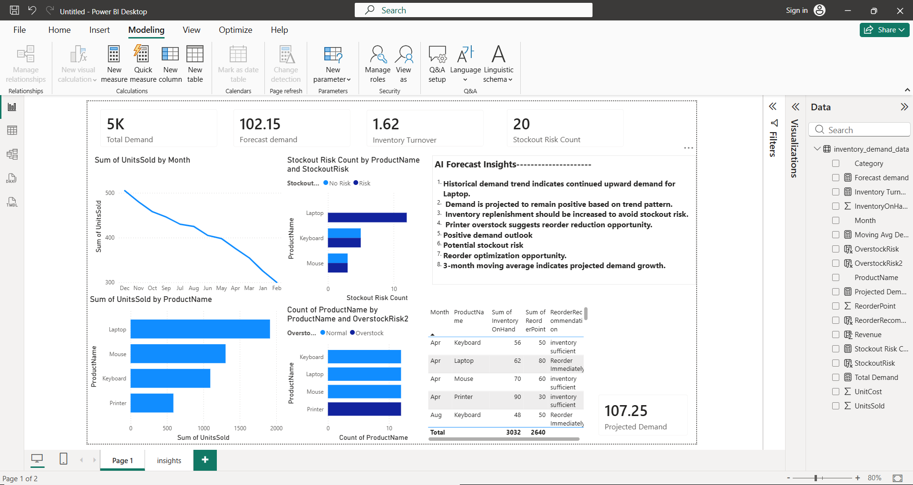
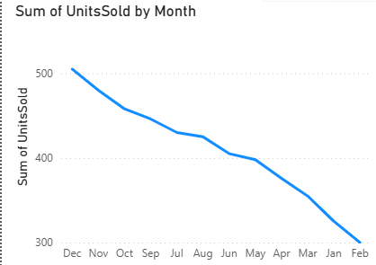
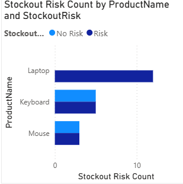
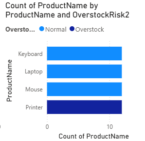
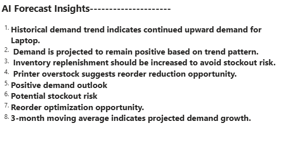
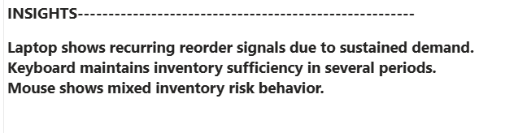

# AI-Augmented Demand Forecasting & Inventory Optimization

## 📌 Overview

This project demonstrates end-to-end analytics from demand analysis to forecasting and inventory optimization, helping reduce stockouts and overstock while improving operational efficiency.

Dataset: Simulated multi-product monthly demand (48 rows)

---

## 🚀 Features

* 📊 Demand Trend Analysis
* 📈 Moving Average Forecasting
* ⚠️ Stockout Risk Detection
* 📦 Overstock Risk Identification
* 🔁 Reorder Recommendation Logic
* 🤖 AI Forecast Insights Panel

---

## 🛠 Tech Stack

* Power BI
* SQL
* DAX
* Excel / CSV

---

## 📊 Key Insights

* Laptop is the highest demand product (1915 units)
* Laptop has highest stockout risk (12)
* Printer shows highest overstock risk (12)
* Projected demand = 107.25 units
* Demand trend indicates future growth

---

## 📂 Repository Structure

dashboard/
data/
images/
sql/

## 📊 Dashboard Preview

## 📈 Demand Trend

## ⚠️ Stockout Risk

## 📦 Overstock Risk

## 📦 AI insights

---

## ▶️ How to Use
1. Open the PBIX file from `dashboard/`
2. Explore KPIs and visuals
3. Use slicers (if any) to filter by product/category
4. Review AI Insights panel for recommendations

## 🎯 Business Impact

* Helps avoid stockouts
* Reduces excess inventory cost
* Improves demand planning
* Enables data-driven inventory decisions
